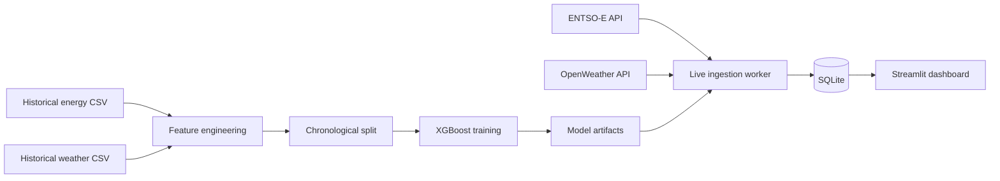

# Spain Electricity Demand Forecasting

An end-to-end machine-learning project for forecasting hourly electricity demand in Spain from historical grid, generation, calendar, and weather data. The project combines an XGBoost forecasting pipeline with an interactive Streamlit and Plotly dashboard.


> **Repository status:** The historical training workflow and dashboard are implemented. In the supplied project snapshot, the real background scheduling worker is missing—`scheduler.py` contains a second copy of the dashboard—so live refresh should be described as work in progress until that worker is restored and tested.

## Why this project

Electricity demand changes with the hour, day of week, season, weather, and generation mix. Reliable short-term forecasts can support grid planning, peak-demand awareness, and energy-cost decisions. This project explores those relationships with a time-aware machine-learning workflow and makes the results accessible through a dashboard.

## Highlights

- Forecasts Spain's hourly total electricity load with XGBoost.
- Uses a chronological 80/20 train/test split instead of a random split.
- Engineers lag, rolling-window, calendar, holiday, cyclical-time, weather, and renewable-generation features.
- Aggregates weather observations across Barcelona, Bilbao, Madrid, Seville, and Valencia.
- Flags predicted peak-demand periods using the training set's 90th-percentile load.
- Visualizes demand, forecasts, energy mix, prices, weather, forecast error, and estimated household cost in Streamlit.
- Includes modules for ENTSO-E and OpenWeather data retrieval and SQLite persistence.

## Architecture



## Data

The supplied data matches the Kaggle dataset [Hourly energy demand, generation and weather](https://www.kaggle.com/datasets/nicholasjhana/energy-consumption-generation-prices-and-weather), which is listed as CC0/Public Domain on its source page.

| File | Contents | Rows | Coverage |
|---|---|---:|---|
| `energy_dataset.csv` | Hourly generation, load, day-ahead forecasts, and prices for Spain | 35,064 | 2015-01-01 to 2018-12-31 |
| `weather_features.csv` | Hourly weather observations for five Spanish cities | 178,396 | 2015-01-01 to 2018-12-31 |

The prediction target is `total_load_actual`. The supplied energy file contains 36 missing target values; preprocessing should document how these records are handled.

For a lean repository, do not commit the raw CSV files. Link to the source above, document the expected filenames, and place downloaded copies locally. If you choose to include the data, retain the attribution and CC0 notice.

## Feature engineering

The shared feature pipeline creates:

- Calendar features: hour, weekday, month, day of year, weekend, and holiday flags.
- Cyclical encodings: sine/cosine transforms for hour and month.
- Demand history: 1-hour, 24-hour, and 168-hour lags plus 3-hour and 24-hour rolling means.
- Grid features: selected generation sources and total renewable generation.
- Weather features: temperature, humidity, pressure, wind, precipitation, cloud cover, and temperature range.

## Model and evaluation

The current training script fits an `XGBRegressor` with 200 estimators, a learning rate of 0.05, maximum depth of 6, row and column subsampling of 0.8, and a fixed random seed. Evaluation uses the final 20% of observations as a chronological holdout.

Before publishing, run the final cleaned pipeline and replace the placeholders below with the exact console output from that run.

| Metric | Test result |
|---|---:|
| MAE | `TBD` MW |
| RMSE | `TBD` MW |
| R² | `TBD` |

Also add a naive baseline, such as "same hour yesterday," so readers can judge whether the model improves on a simple forecasting rule.

## Local setup

### 1. Clone the repository

```powershell
git clone https://github.com/YOUR-USERNAME/spain-electricity-demand-forecasting.git
cd spain-electricity-demand-forecasting
```

### 2. Create a virtual environment

```powershell
py -m venv .venv
.\.venv\Scripts\Activate.ps1
python -m pip install --upgrade pip
pip install -r requirements.txt
```

### 3. Add the historical data

Download the two CSV files from the dataset page. With the current training script, place them in the repository root:

```text
energy_dataset.csv
weather_features.csv
```

### 4. Configure API credentials

The published version of `config.py` must read credentials from environment variables; never place real keys in source code. Use the supplied `config.py.safe-example` as a safe replacement and add `python-dotenv>=1.0,<2` to `requirements.txt`. Either copy `.env.example` to an ignored local `.env` file or set the variables for the current PowerShell session:

```powershell
$env:ENTSOE_API_KEY = "your-new-entsoe-key"
$env:OPENWEATHER_API_KEY = "your-new-openweather-key"
```

### 5. Train the model

```powershell
python train.py
```

This command creates the model, imputer, feature-name, and peak-threshold artifacts used by the application.

### 6. Open the dashboard

After keeping one final dashboard file and renaming it to `app.py`:

```powershell
streamlit run app.py
```

Live panels will populate only after the missing scheduling worker has been restored and has written actuals and forecasts to SQLite.

## Recommended repository structure

```text
spain-electricity-demand-forecasting/
├── app.py
├── README.md
├── LICENSE
├── requirements.txt
├── .env.example
├── .gitignore
├── assets/
│   └── dashboard-overview.png
├── data/
│   └── README.md
├── models/
│   └── README.md
├── scripts/
│   └── train.py
├── src/
│   └── electricity_forecast/
│       ├── __init__.py
│       ├── config.py
│       ├── database.py
│       ├── features.py
│       ├── fetcher.py
│       └── worker.py
└── tests/
    ├── test_features.py
    └── test_database.py
```

The existing flat layout can be published for a first version, but this structure gives the project a clearer separation between application code, training scripts, data documentation, model artifacts, and tests.

## Known limitations

- The recurring live-ingestion worker is absent from the supplied snapshot and must be restored.
- Holiday features currently use the US calendar even though the data is Spanish; switch to Spain holidays before reporting final results.
- Confirm that every feature used for a 24-hour forecast is genuinely available at prediction time; contemporaneous actual generation can leak future information.
- The current split is chronological, but walk-forward validation would provide a stronger estimate of real-world performance.
- The model does not yet provide prediction intervals or uncertainty estimates.
- API failures and missing live observations need clearer retry, alerting, and monitoring behavior.

## Roadmap

- Restore and test the hourly ingestion/forecast worker.
- Add naive and ENTSO-E day-ahead baselines.
- Add walk-forward validation and feature-importance analysis.
- Add automated tests and a GitHub Actions workflow.
- Store the XGBoost model in its native JSON/UBJ format instead of a pickle where practical.
- Deploy the dashboard and add the live URL and screenshot near the top of this README.

## Acknowledgements

- Historical data: [Hourly energy demand, generation and weather](https://www.kaggle.com/datasets/nicholasjhana/energy-consumption-generation-prices-and-weather)
- Grid data: [ENTSO-E Transparency Platform](https://transparency.entsoe.eu/)
- Weather data: [OpenWeather](https://openweathermap.org/)

## License

Add an MIT `LICENSE` file only if you own the project code and want to permit reuse under those terms. The historical dataset is separately identified as CC0 on its source page; third-party APIs remain subject to their own terms.
